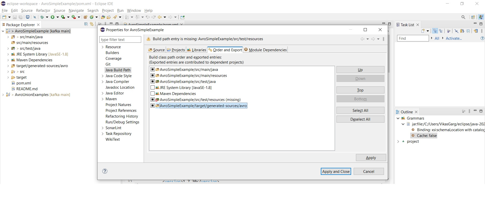
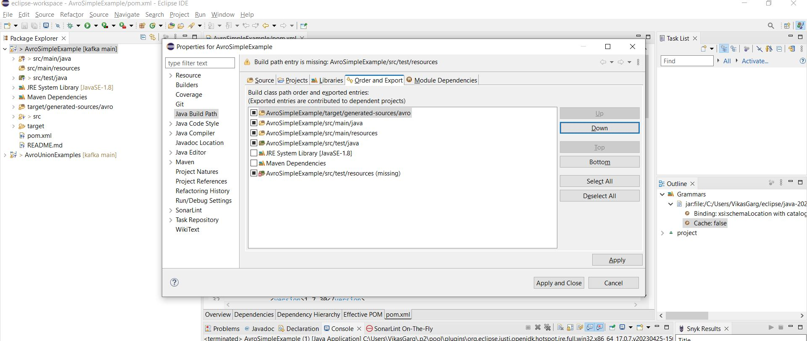

# kafka

Contains Java code snippets for Kafka 

### top-level directory layout
    .
    ├── AvroExamples            # Avro files 
      └── AvroSimpleExample     # Simple Avro schema example
      └── AvroUnionExample      # Avro schema with "union of types" example
    └── README.md

### IDE Setup (Eclipse)
After cloning from github: 
- import the individual project (AvroSimpleExample for example) into Eclipse as a Maven project.

- Ensure that `target/generated-sources/avro` is before `src/main/java` in build path:

    * Check `Right Click Project -> Build Path -> Configure Build Path...`
    

    * Reorder build class path order if required  
    

